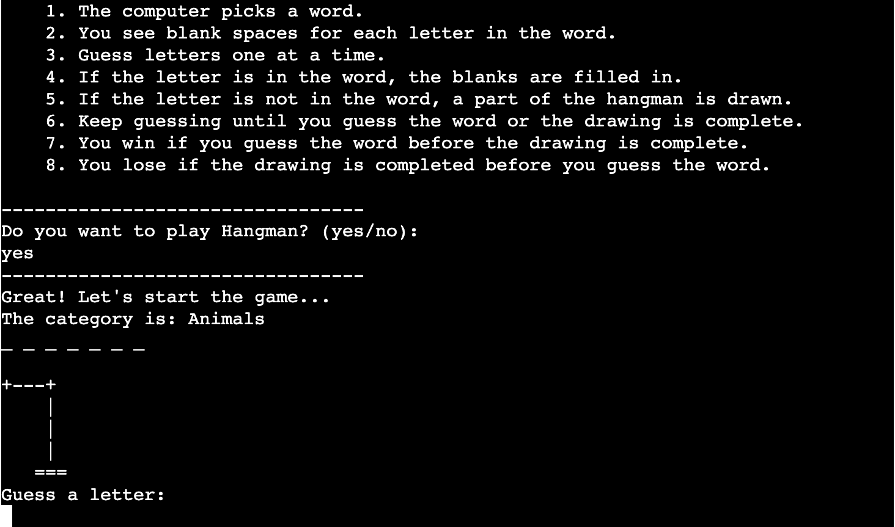
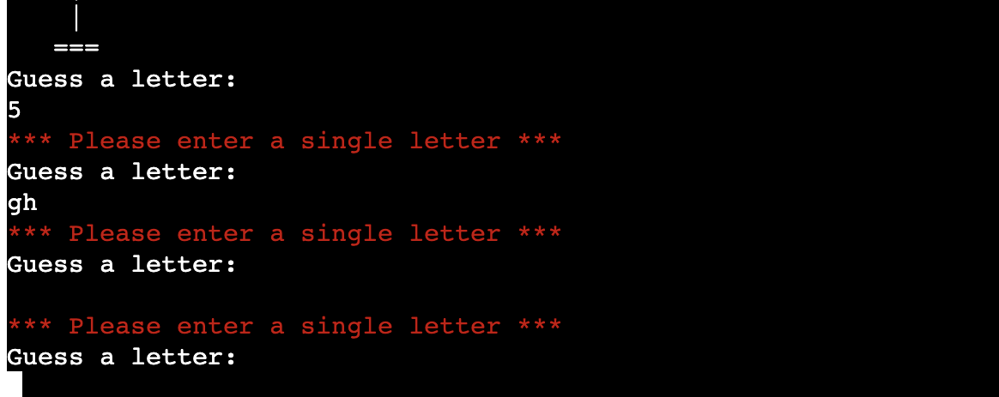
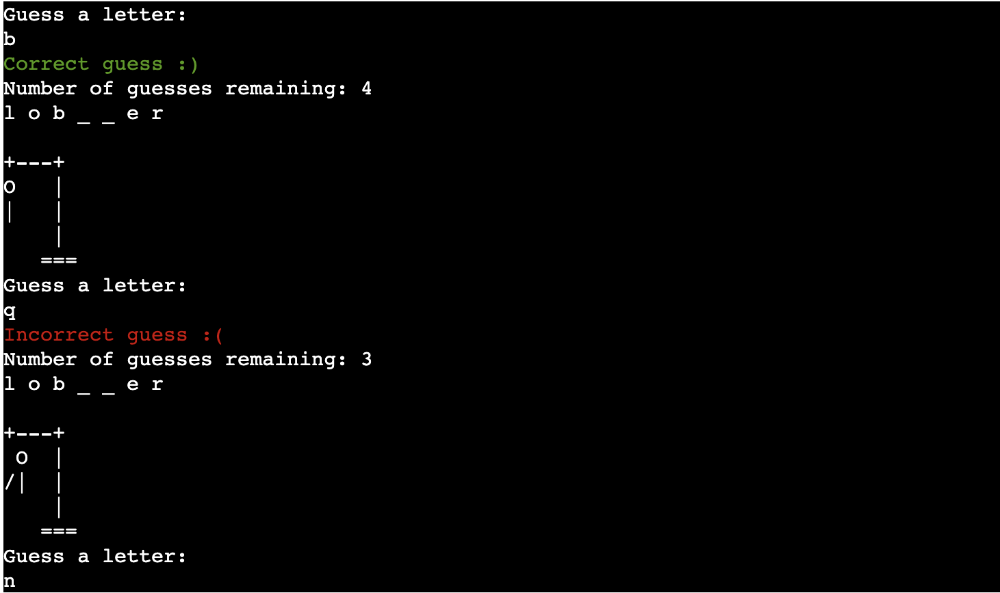
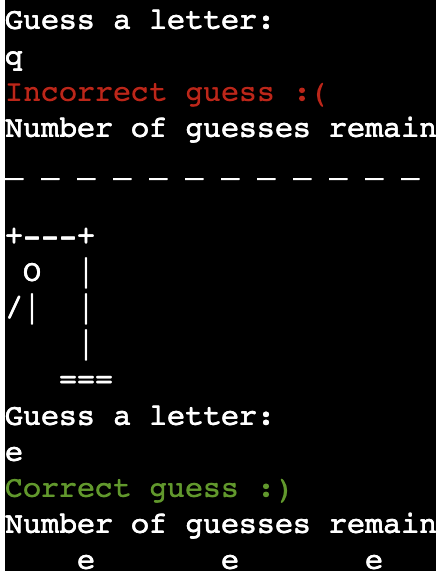
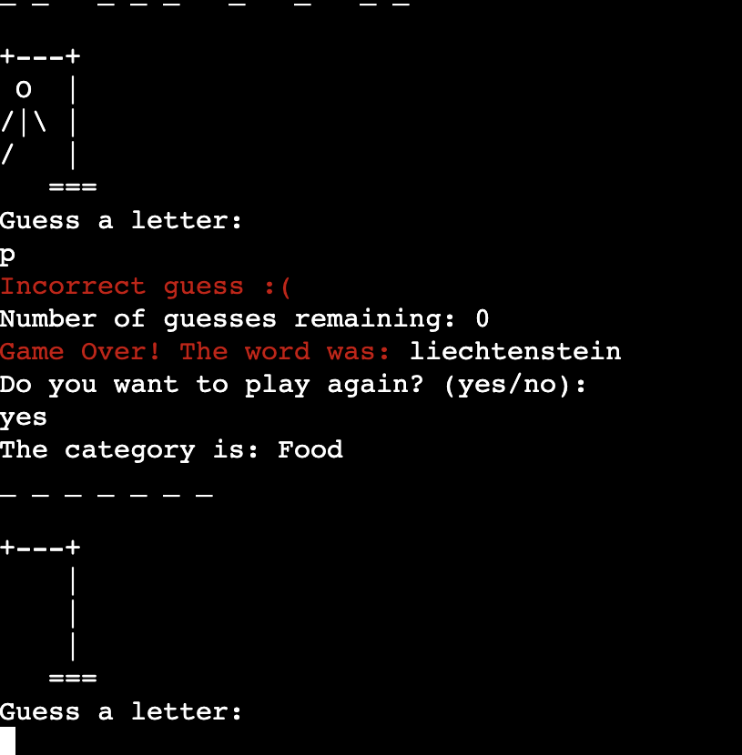
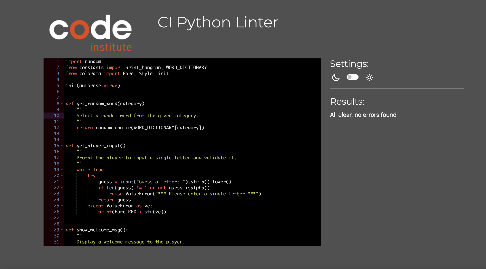
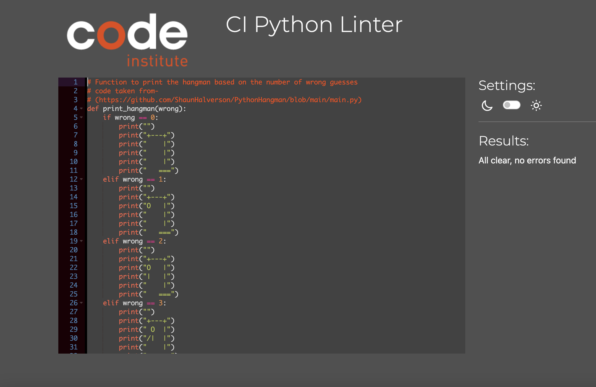

# Hangman Game

Hangman is a classic word-guessing game where players try to guess a hidden word by suggesting letters within a certain number of guesses. This version of the game is implemented in Python and provides an interactive terminal-based experience.

## How to play

1. The computer selects a random word from a chosen category.
2. The player guesses letters one at a time.
3. If the guessed letter is in the word, the blanks are filled in.
4. If the guessed letter is not in the word, a part of the hangman is drawn.
5. The player wins if they guess the word before the hangman is fully drawn.
6. The player loses if the hangman is fully drawn before the word is guessed.

# Table of contents
- [Structure](#structure)
- [Development Rational](#dev-ration)
- [Features](#features)
    - [Existing Features](existing-features)
    - [Future Features](future-features)
- [Data Model](#data-model)
- [Testing Procedures and Results](#testing)
    - [Validator Testing](#validator-testing)
- [Bugs](#bugs)
    - [Solved Bugs](#solved-bugs)
    - [Remaining Bugs](#remaining-bugs)
- [Deployment Instructions](#deployment)
- [Credits](#credits)

## Structure
The project is structured as follows:
- `run.py`: The main program that runs the game.
- `constants.py`: Contains the function for printing the hangman and the dictionary of word categories.
- `requirements.txt`: Lists the external Python libraries required to run the game.

Using Lucidchart, the steps to play the game were clearly laid out, making the development process smoother and ensuring that the logic was consistent and complete. The flowchart served as a blueprint, guiding the development and making it easier to debug and expand the game in the future.

## Development Rational

## Features

### Existing Features
- **Random Word Selection**: The game selects a random word from predefined categories.

- **User Input Validation**: Ensures that the player inputs a single alphabetic character.

- **Hangman Drawing**: Displays the hangman progressively as incorrect guesses are made.

- **Feedback Messages**: Provides feedback to the player for correct and incorrect guesses.

- **Replay Option**: Allows the player to play multiple rounds without restarting the program.

### Future features

- **Additional Categories**: More word categories can be added for increased variety.
- **Difficulty Levels**: Implement different difficulty levels based on the length of the word or the number of allowed incorrect guesses.
- **Graphical Interface**: Develop a GUI version of the game using a library.

## Data Model

The Hangman game revolves around several key data elements:

1. **Word Dictionary**: This dictionary contains word categories as keys and lists of words as values. It is used to select a random word for the player to guess.

2. **Chosen Category**: Represents the category of the word chosen for the current game session.

3. **Selected Word**: The word chosen from the Word Dictionary for the player to guess.

4. **Guessed Letters**: A set containing the letters that the player has guessed so far.

5. **Attempts**: The number of incorrect guesses the player has made.

6. **Display Word**: A list representing the current state of the word being guessed, with underscores for unguessed letters and actual letters for correctly guessed ones.

These data elements are manipulated and utilised throughout the game to facilitate the player's interaction and progress.

## Testing Procedures and Results

The game has been extensively tested to ensure its functionality and robustness. Testing was performed both locally in the terminal and in the Heroku terminal environment.

During development, various test scenarios were conducted, including inputting incorrect guesses as well as correct ones. These tests were repeated multiple times to validate consistent behavior and to identify any edge cases or unexpected behavior.

### Validator Testing

- The code has been checked using PEP 8 standards to ensure proper formatting and style.
- External validators were used to check the README.md for consistent and effective markdown formatting.

## Bugs

### Solved Bugs

- **Input Validation**: Initially, the game did not properly validate user input, leading to potential errors. This issue was addressed by implementing robust input validation checks, ensuring that only single alphabetic characters are accepted as valid input.
- **Game Loop**: There were issues with the game loop that affected the replay functionality. These issues were resolved by refactoring the game loop code to ensure proper execution and handling of replay requests.

### Remaining Bugs

- No known remaining bugs at this time. Further testing may reveal edge cases that need addressing.

## Deployment Instructions

This project was deployed using Code Institute's mock terminal for Heroku.

### Steps for Deployment:

1. Fork or clone this repository.
2. Create a new Heroku app.
3. Set the buildpacks to Python and Node.js in that order.
4. Link the Heroku app to the repository.
5. Click on Deploy.

## Credits

The following resources were instrumental in the development of this Hangman game:

- [HangmanDesign](https://github.com/ShaunHalverson/PythonHangman/blob/main/main.py): Inspiration and base code for the hangman drawing function.
- [Colorama](https://www.geeksforgeeks.org/print-colors-python-terminal/): Library used for colored text in the terminal.
- [README.md contents structure](https://github.com/fraserivison/astronaut-quiz/blob/main/README.md): Guidance on structuring the README contents structure.
- [README.md general structure](https://learn.codeinstitute.net/courses/course-v1:CodeInstitute+PE_PAGPPF+2021_Q2/courseware/b3378fc1159e43e3b70916fdefdfae51/605f34e006594dc4ae19f5e60ec75e2e/): Guidance on structuring the README file and deployment instructions.
- **OpenAI's ChatGPT**: Used to validate code snippets and provide logical insights during development. ChatGPT helped ensure the correctness and efficiency of various algorithms and implementations.

## End.

[Back to TOP](#table-of-contents)
