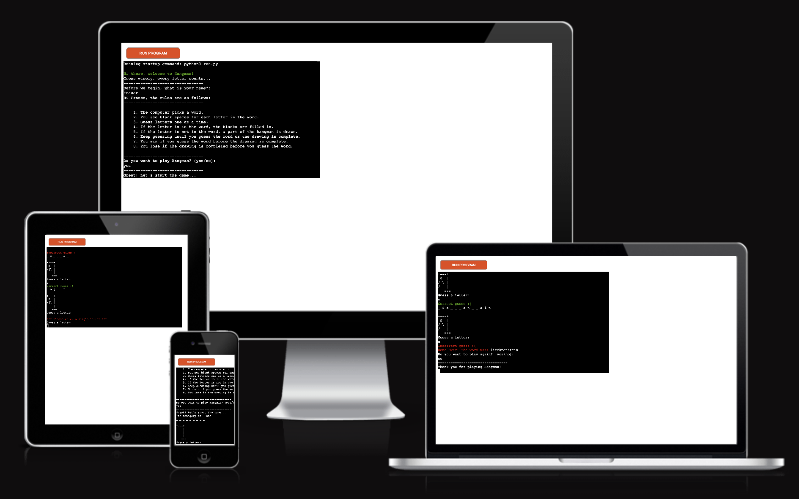
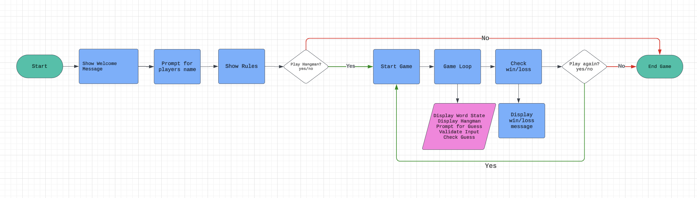

# Hangman Game

Hangman is a classic word-guessing game where players try to guess a hidden word by suggesting letters within a certain number of guesses. This version of the game is implemented in Python and provides an interactive terminal-based experience.

## How to play

1. The computer selects a random word from a chosen category.
2. The player guesses letters one at a time.
3. If the guessed letter is in the word, the blanks are filled in.
4. If the guessed letter is not in the word, a part of the hangman is drawn.
5. The player wins if they guess the word before the hangman is fully drawn.
6. The player loses if the hangman is fully drawn before the word is guessed.

# Table of contents
- [Structure](#structure)
- [Development Rational](#dev-ration)
- [Features](#features)
    - [Existing Features](existing-features)
    - [Future Features](future-features)
- [Data Model](#data-model)
- [Testing Procedures and Results](#testing)
    - [Validator Testing](#validator-testing)
- [Bugs](#bugs)
    - [Solved Bugs](#solved-bugs)
    - [Remaining Bugs](#remaining-bugs)
- [Deployment Instructions](#deployment)
- [Credits](#credits)

## Structure
The project is structured as follows:
- `run.py`: The main program that runs the game.
- `constants.py`: Contains the function for printing the hangman and the dictionary of word categories.
- `requirements.txt`: Lists the external Python libraries required to run the game.

Using Lucidchart, the steps to play the game were clearly laid out, making the development process smoother and ensuring that the logic was consistent and complete. The flowchart served as a blueprint, guiding the development and making it easier to debug and expand the game in the future.

## Development Rational

## Features

### Existing Features

### Future features

## Data Model

## Testing Procedures and Results

### Validator Testing

## Bugs

### Solved Bugs

### Remaining Bugs

## Deployment Instructions

## Credits

[HangmanDesign](https://github.com/ShaunHalverson/PythonHangman/blob/main/main.py)
[Colorama](https://www.geeksforgeeks.org/print-colors-python-terminal/)
[README.md contents layout](https://github.com/fraserivison/astronaut-quiz/blob/main/README.md)

## End.

[Back to TOP](#table-of-contents)
